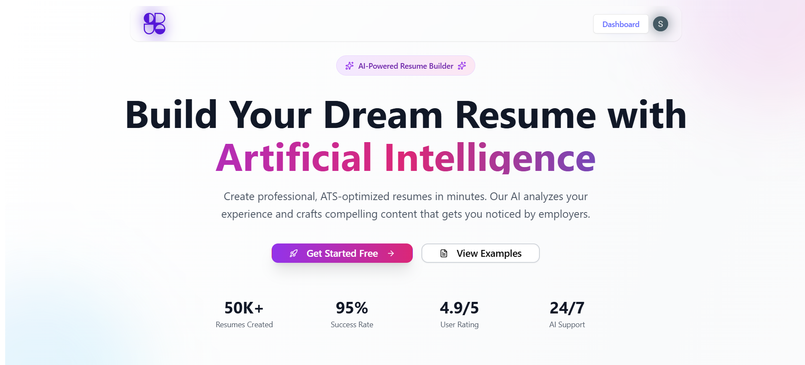
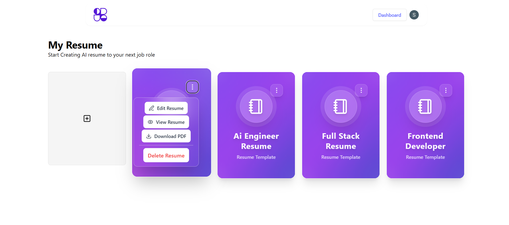
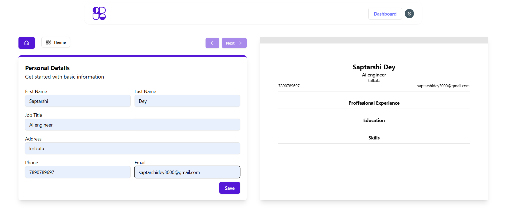
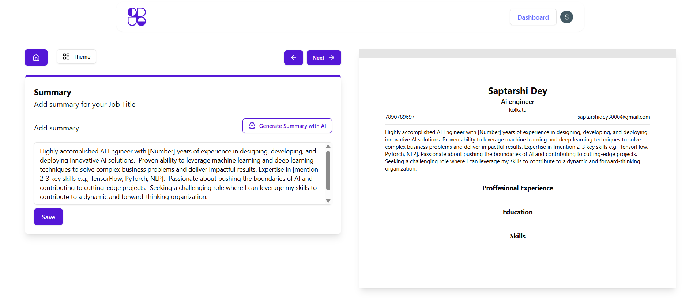
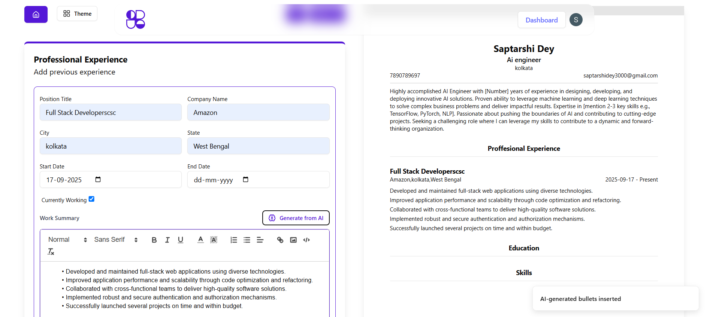
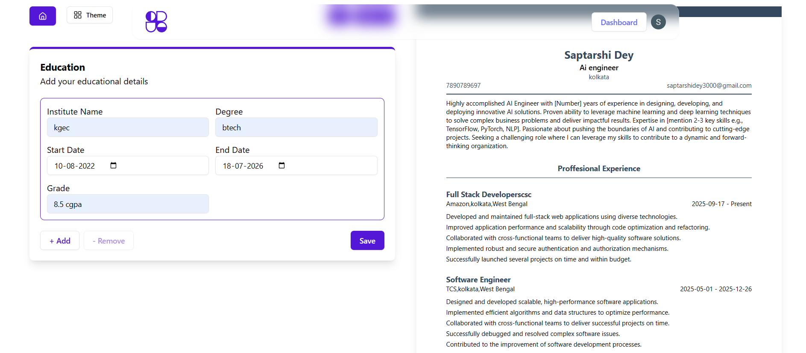
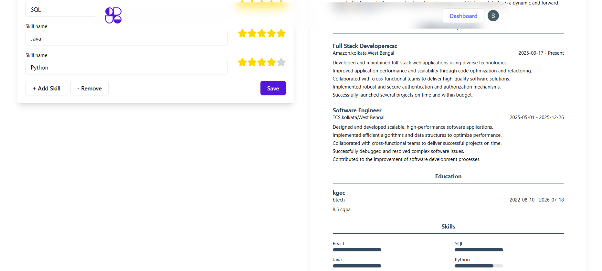
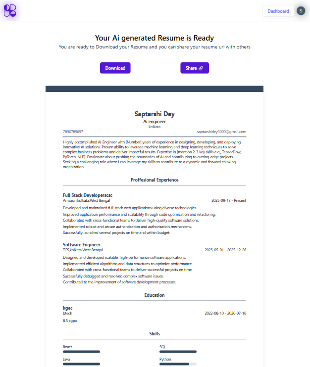
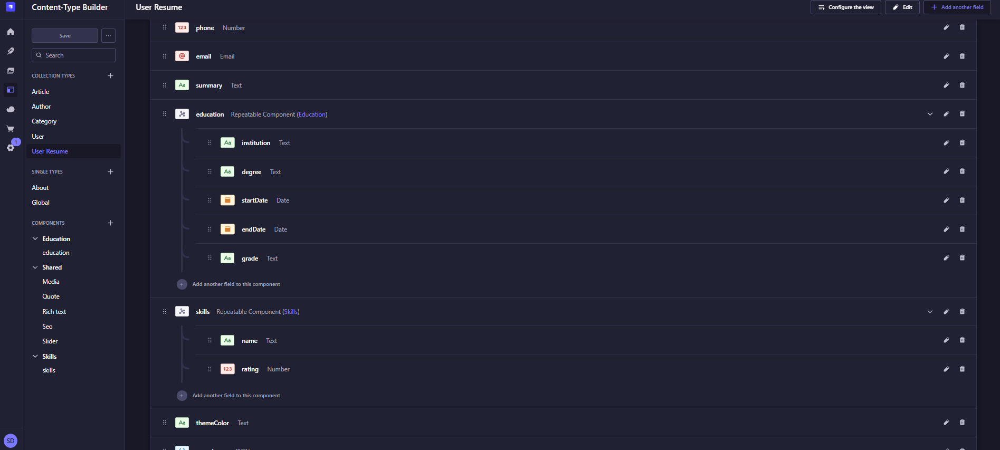

# 📄 AI Resume Builder  


> An AI-powered Resume Builder that helps users create, edit, and optimize professional resumes instantly.  
> Features include **AI-generated summary & experience suggestions** and a **Strapi backend** for secure data management.

---

## 🚀 Features  
- 🤖 **AI-Powered Content** – Auto-generate resume summary & work experience  
- 🎨 **Modern UI** – Responsive design with TailwindCSS  
- 🛠️ **Full-Stack Setup** – React frontend + Strapi backend  
- 📤 **Export Options** – Download resumes as PDF  
- 🔒 **Authentication** – Secure login & user accounts  

---

## 🖼️ Screenshots  

> Screenshots are stored in `public/screenshots/`  

  
  
  
  
  
  
  
  
  

---

## 🏗️ Tech Stack  
- **Frontend:** React, Redux Toolkit, TailwindCSS  
- **Backend:** Strapi (Node.js)  
- **Database:** MySQL  
- **Other Tools:** Gemini API (AI content generation), Axios, JWT  

---

## ⚙️ Installation  

Clone the repo:  
```bash
git clone https://github.com/your-username/ai-resume-builder.git
cd ai-resume-builder
